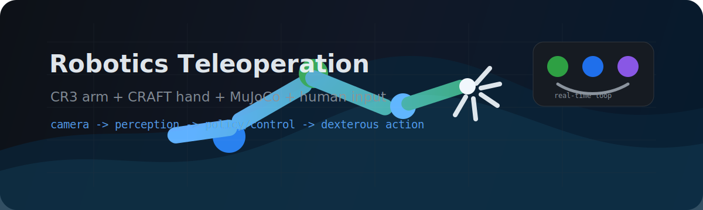

<p align="center">
  
</p>

<h1 align="center">Hi, I am fslee2</h1>

<p align="center">
  Robotics, dexterous manipulation, teleoperation, and embodied AI experiments.
</p>

<p align="center">
  <a href="https://github.com/fslee2/cr3-craft-teleop-showcase">
    
  </a>
  
  
</p>

---

### Current Direction

I build and test robot teleoperation systems that connect human motion input to simulated and physical robot hands.

Right now I am focusing on:

- CR3 robot arm and CRAFT dexterous hand integration in DexJoCo.
- Hand-driven teleoperation interfaces using MediaPipe, dual cameras, keyboard clutching, and VR experiments.
- Lightweight alternatives to expensive monocular 3D hand reconstruction pipelines.
- Practical robot task scenes such as clicking a mouse, reaching, grasping, and shell-style tabletop manipulation.

---

### Featured Work

<table>
  <tr>
    <td width="55%">
      <a href="https://github.com/fslee2/cr3-craft-teleop-showcase">
        
      </a>
    </td>
    <td width="45%">
      <h3>CR3 + CRAFT Teleoperation Showcase</h3>
      <p>
        A curated robotics showcase around integrating a CR3 arm and CRAFT hand into DexJoCo environments.
      </p>
      <p>
        It includes MuJoCo XML assets, DexJoCo-style environment wrappers, MediaPipe teleoperation scripts,
        Windows uv setup notes, dual-camera depth experiments, and handoff documentation.
      </p>
      <p>
        <a href="https://github.com/fslee2/cr3-craft-teleop-showcase"><b>Open project</b></a>
      </p>
    </td>
  </tr>
</table>

---

### Project Map

| Project | What it is about | Main stack |
|---|---|---|
| [cr3-craft-teleop-showcase](https://github.com/fslee2/cr3-craft-teleop-showcase) | CR3 + CRAFT DexJoCo integration and teleop demos | Python, MuJoCo, DexJoCo |
| [cr3-robot-description-assets](https://github.com/fslee2/cr3-robot-description-assets) | MuJoCo XML and URDF assets for CR3 + CRAFT simulation | MuJoCo, URDF, ROS2 |
| [Dobot-CraftHand](https://github.com/fslee2/Dobot-CraftHand) | CRAFT hand and robot control experiments | Python |
| [Lerobot_robomimic](https://github.com/fslee2/Lerobot_robomimic) | Imitation learning and robot learning experiments | Python |
| [JetArm-Dummy](https://github.com/fslee2/JetArm-Dummy) | Master-slave teleoperation between JetArm and Dummy | C |

---

### Robotics Stack

```text
Simulation      MuJoCo, DexJoCo
Teleoperation   MediaPipe, cameras, keyboard control, VR experiments
Robot Learning  imitation learning, robomimic, LeRobot-style pipelines
Languages       Python, C/C++, shell scripting
Tools           GitHub, ROS2, uv, conda, WSL, Windows development
```

---

### GitHub Snapshot

<p align="center">
  
  
</p>

---

### What I Like To Build

I like systems where the interface is physical and the feedback is immediate:

- a hand moving in front of a camera;
- a simulated manipulator responding in MuJoCo;
- a dexterous hand turning perception into contact-rich action;
- a messy prototype slowly becoming a usable robotics tool.

That is the part of robotics I care about most: getting ideas out of papers and into working loops.
