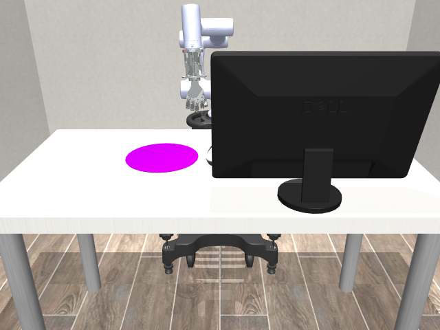
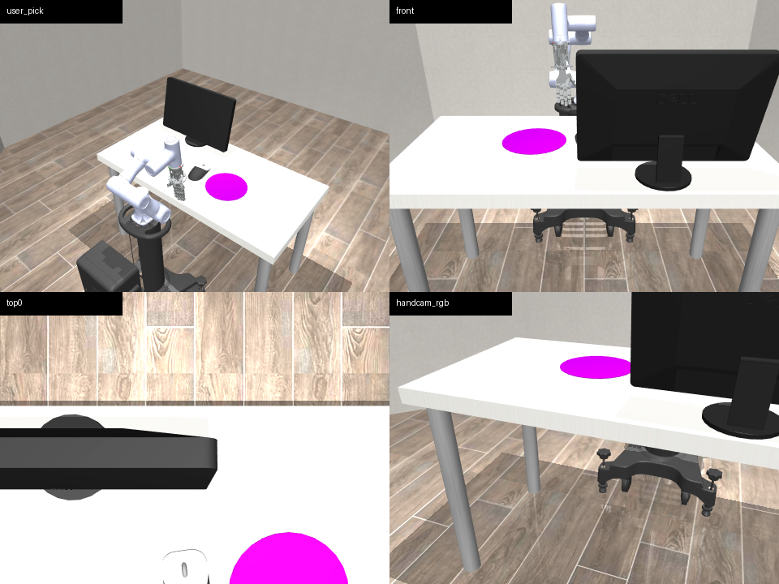
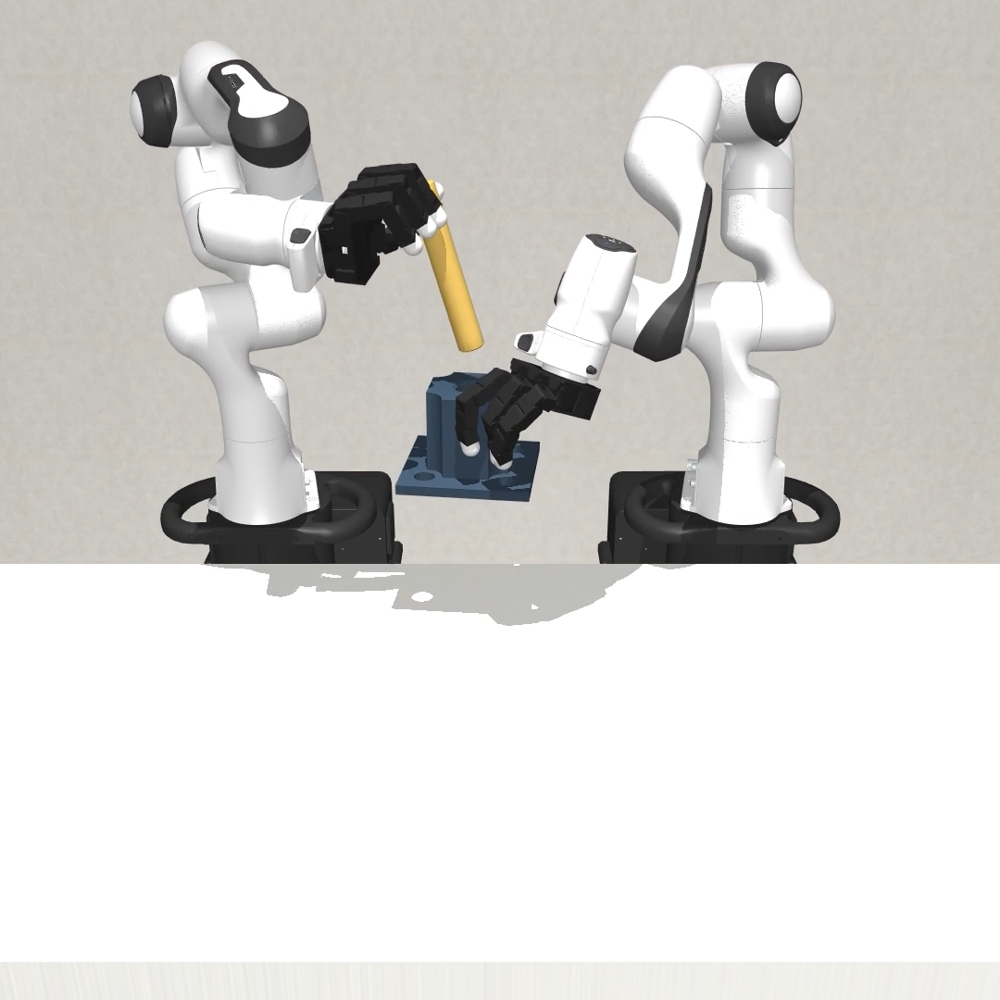
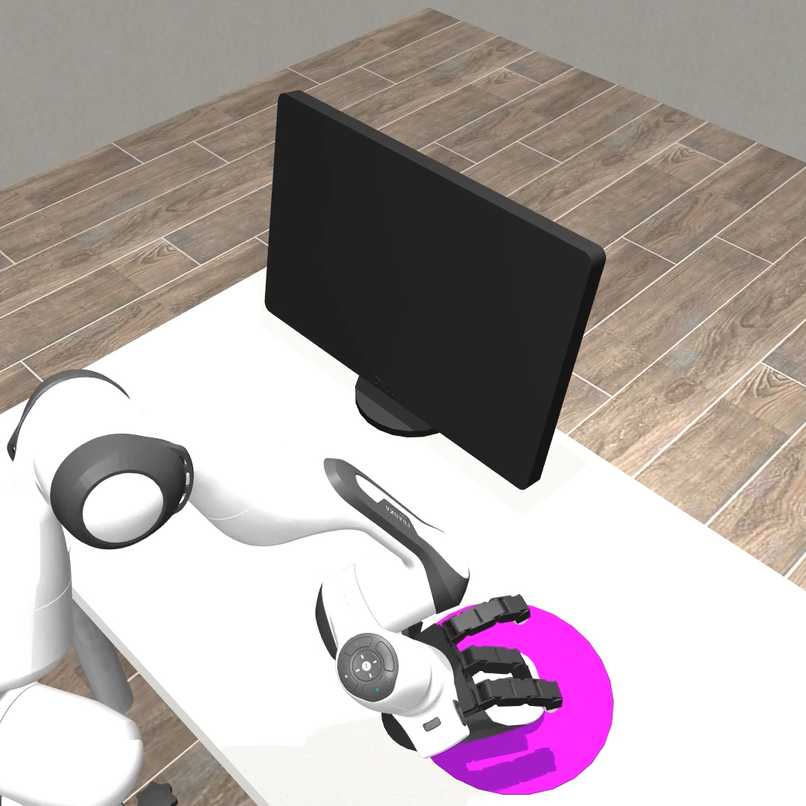
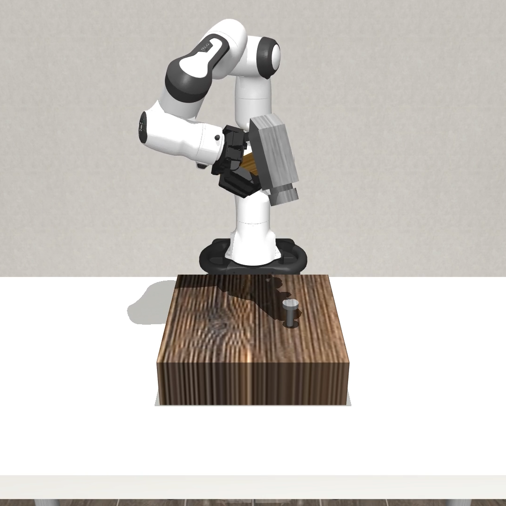
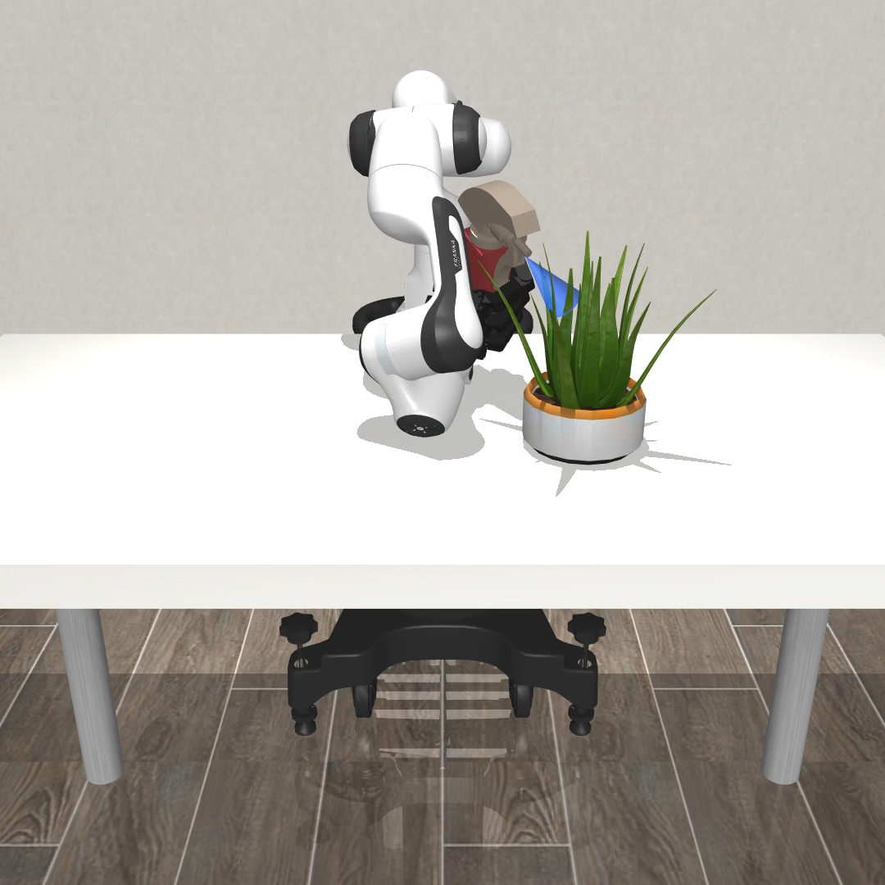
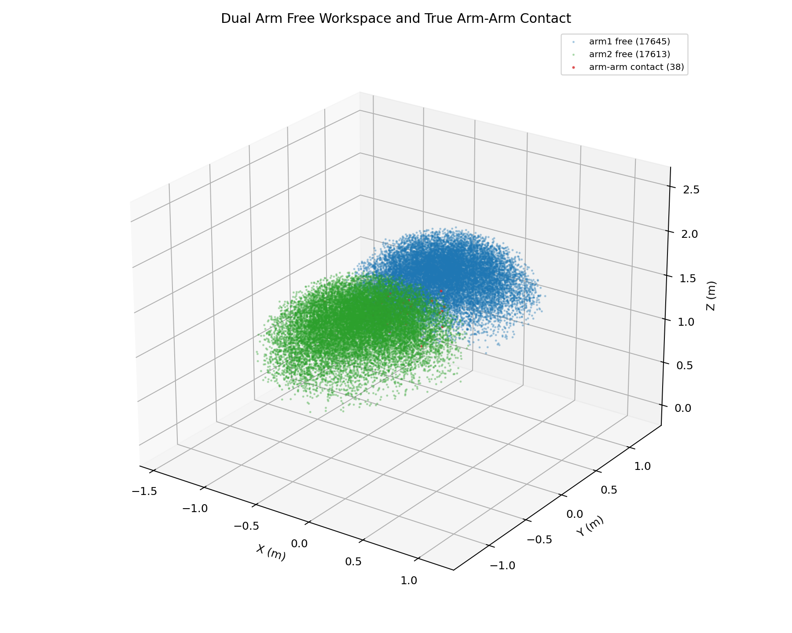
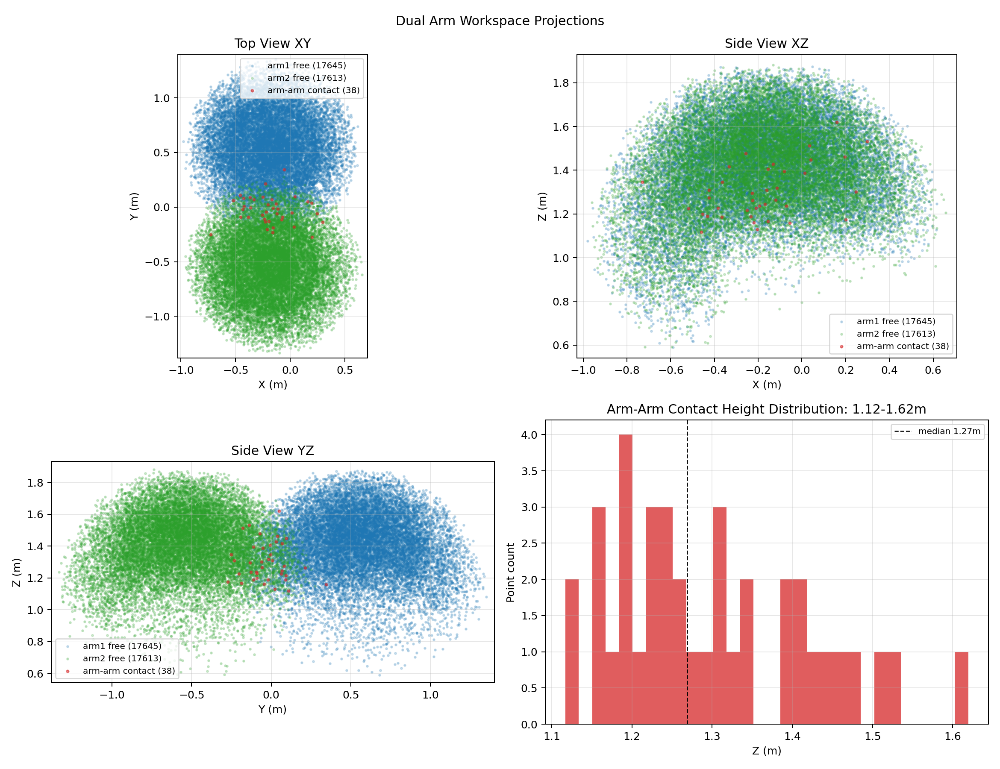
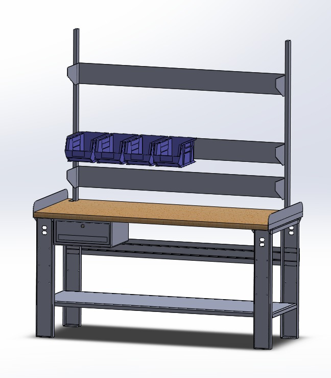

# Yujie Pang / fslee2

Robotics, dexterous manipulation, teleoperation, and embodied AI experiments.

I am currently building practical robot teleoperation systems around MuJoCo, DexJoCo, ROS2, camera-based hand tracking, and dexterous robot hands.

## Visual Portfolio

### CR3 + CRAFT Teleoperation


| CR3 + CRAFT shell scene | Multi-camera MuJoCo views |
|---|---|
|  |  |

### DexJoCo Task Scenes

| Bimanual assembly | Click-mouse task |
|---|---|
|  |  |

| Hammer task | Plant task |
|---|---|
|  |  |

### Engineering Artifacts

| CR3 workspace analysis | Projection analysis |
|---|---|
|  |  |

| Workstation CAD mockup |
|---|
|  |

## Current Focus

- CR3 robot arm and CRAFT dexterous hand simulation.
- MuJoCo / DexJoCo task environments for robot teleoperation.
- Human input interfaces using cameras, keyboard control, and VR experiments.
- Lightweight alternatives to heavy monocular 3D hand reconstruction.
- Imitation learning and robot-control pipelines.

## Featured Projects

| Project | What it contains | Stack |
|---|---|---|
| [cr3-craft-teleop-showcase](https://github.com/fslee2/cr3-craft-teleop-showcase) | CR3 + CRAFT DexJoCo integration, teleop scripts, docs, screenshots, and GIF demo | Python, MuJoCo, DexJoCo |
| [cr3-robot-description-assets](https://github.com/fslee2/cr3-robot-description-assets) | MuJoCo XML / MJCF and URDF assets for CR3 + CRAFT simulation | MuJoCo, URDF, ROS2 |
| [Dobot-CraftHand](https://github.com/fslee2/Dobot-CraftHand) | CRAFT hand and robot-control experiments | Python |
| [Lerobot_robomimic](https://github.com/fslee2/Lerobot_robomimic) | Robot learning and imitation-learning experiments | Python |
| [JetArm-Dummy](https://github.com/fslee2/JetArm-Dummy) | Master-slave teleoperation between JetArm and Dummy | C |

## Main Robotics Stack

```text
Simulation      MuJoCo, DexJoCo
Robot assets    MJCF/XML, URDF, STL, MoveIt config
Teleoperation   MediaPipe, cameras, keyboard control, VR experiments
Robot learning  imitation learning, robomimic, LeRobot-style pipelines
Languages       Python, C/C++, shell scripting
Tools           GitHub, ROS2, uv, conda, WSL, Windows
```

## Recent Work

The main recent work is the CR3 + CRAFT integration:

- extracted and organized CR3 robot-description assets;
- prepared reusable MuJoCo XML / MJCF entry points;
- connected CR3 arm + CRAFT hand assets into DexJoCo scenes;
- tested teleoperation entry scripts;
- documented handoff notes and Windows/WSL setup.
- collected project visuals into this profile as a lightweight robotics portfolio.

Start here:

- [CR3 + CRAFT Teleop Showcase](https://github.com/fslee2/cr3-craft-teleop-showcase)
- [CR3 MuJoCo / URDF Assets](https://github.com/fslee2/cr3-robot-description-assets)
