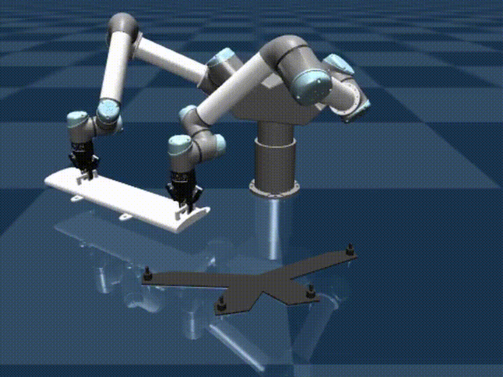
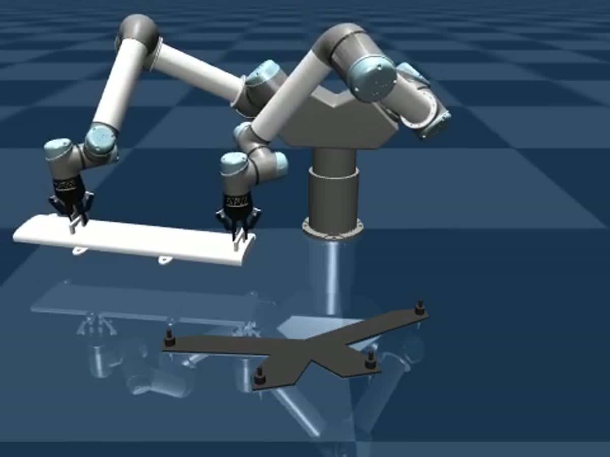
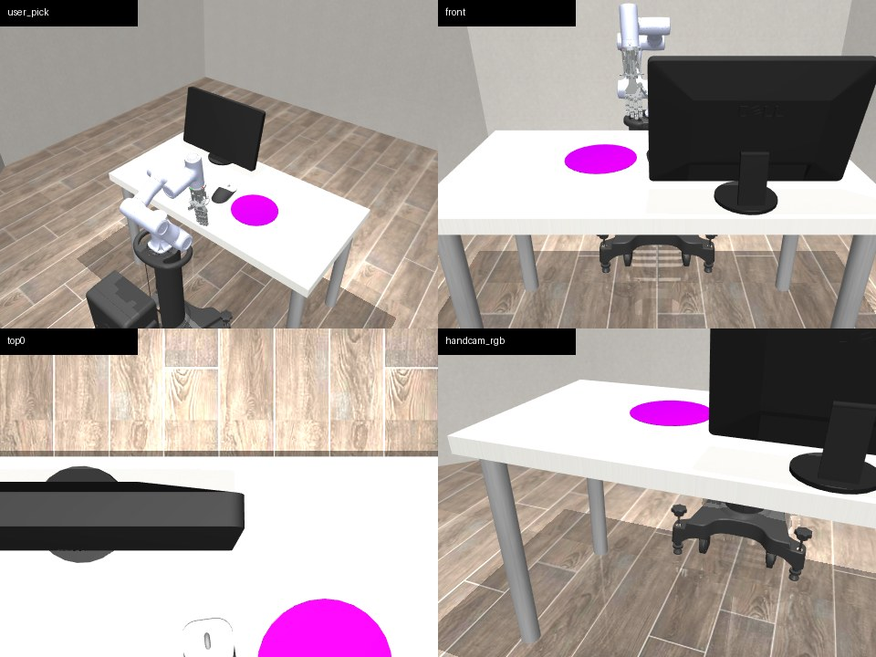
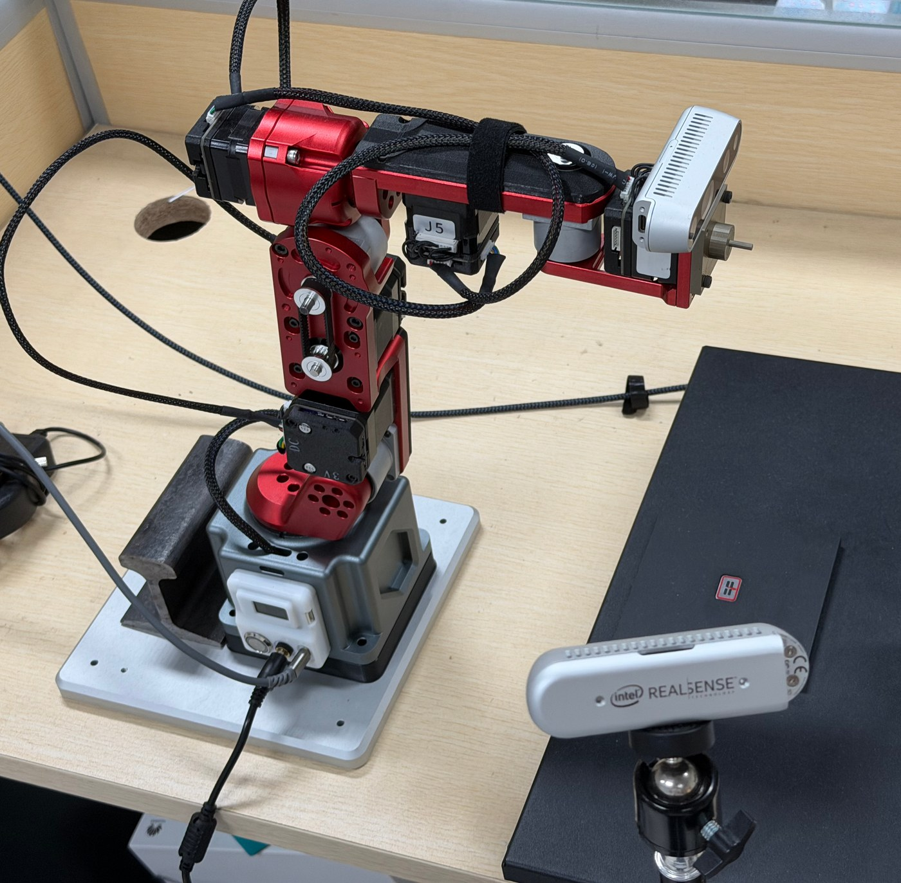
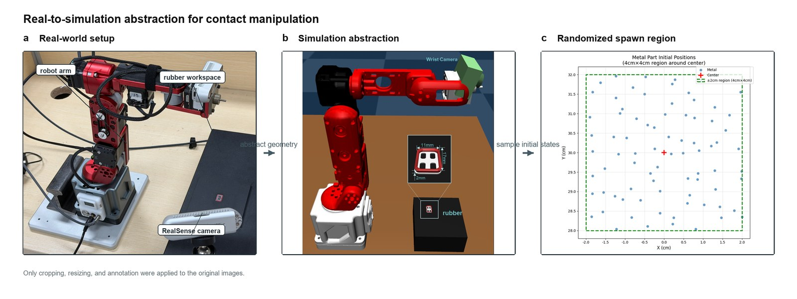
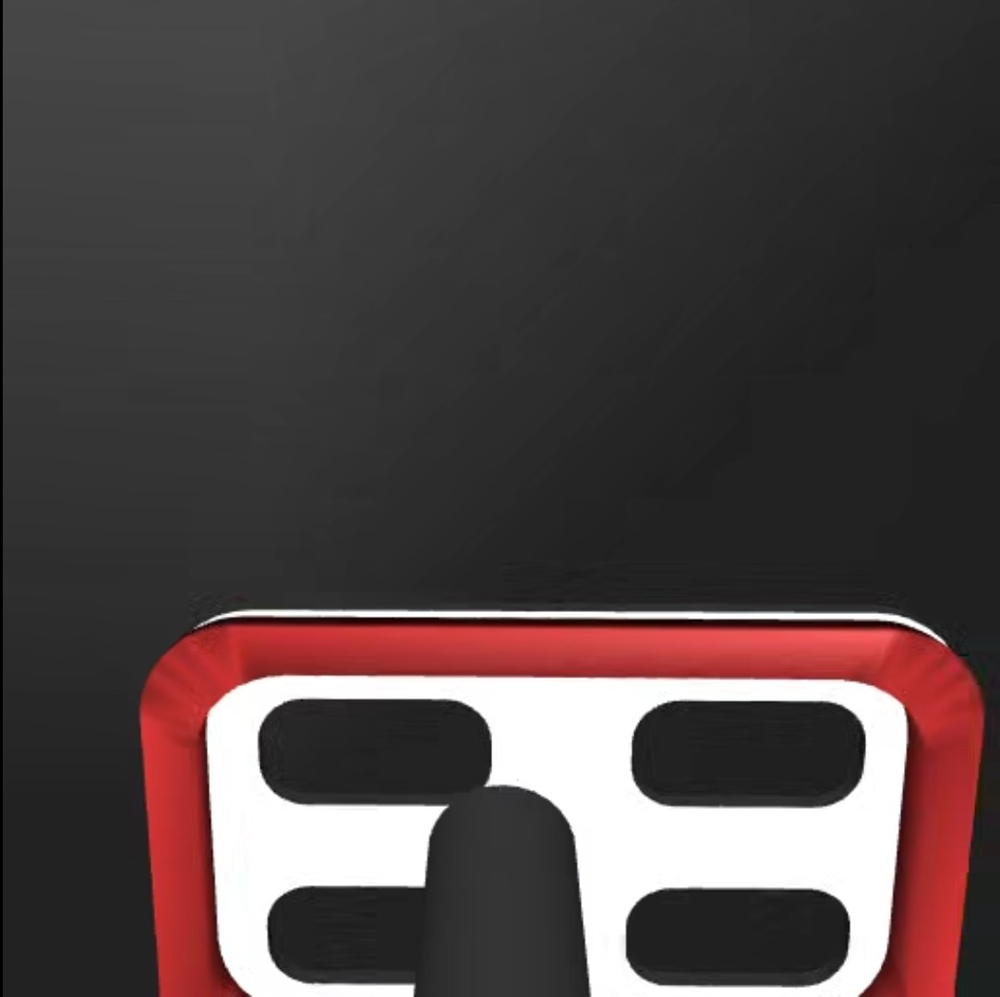

# Yujie Pang / fslee2

Robotics, bimanual imitation learning, dexterous manipulation, teleoperation, and embodied AI experiments.

I build small but complete robot systems: simulation assets, control scripts, camera/VR teleoperation tests, and imitation-learning pipelines that can move from a local prototype toward a publishable project.

## Project Snapshots

### Bimanual Imitation

Workspace: `F:\Mys_lab_data_bak\bimanual-imitation`





This project focuses on two-arm manipulation, LeRobot-style datasets, ACT-style policy inference, and MuJoCo validation rollouts.

### CR3 + CRAFT in DexJoCo




This work connects a CR3 arm and CRAFT dexterous hand into DexJoCo-style MuJoCo environments, with reusable XML/MJCF assets and teleoperation entry scripts.

### CRAFT Hand / Real Robot Contact Work







This line of work is about contact-rich manipulation: real setup capture, simulation abstraction, tactile/contact observations, and robot-control experiments.

## Current Focus

- Bimanual imitation learning and policy validation.
- CR3 arm + CRAFT hand simulation assets.
- MuJoCo / DexJoCo task environments for robot teleoperation.
- Camera, keyboard, and VR input interfaces for robot control.
- Lightweight alternatives to heavy monocular 3D hand reconstruction.
- Real-to-simulation workflows for contact manipulation.

## Featured Repositories

- [cr3-craft-teleop-showcase](https://github.com/fslee2/cr3-craft-teleop-showcase): CR3 + CRAFT DexJoCo integration, teleop scripts, docs, screenshots, and GIF demos.
- [cr3-robot-description-assets](https://github.com/fslee2/cr3-robot-description-assets): MuJoCo XML / MJCF and URDF assets for CR3 + CRAFT simulation.
- [Dobot-CraftHand](https://github.com/fslee2/Dobot-CraftHand): CRAFT hand and robot-control experiments.
- [Lerobot_robomimic](https://github.com/fslee2/Lerobot_robomimic): robot learning and imitation-learning experiments.
- [JetArm-Dummy](https://github.com/fslee2/JetArm-Dummy): master-slave teleoperation between JetArm and Dummy.

## Main Robotics Stack

```text
Simulation      MuJoCo, DexJoCo
Robot assets    MJCF/XML, URDF, STL, MoveIt config
Teleoperation   MediaPipe, cameras, keyboard control, VR experiments
Robot learning  imitation learning, robomimic, LeRobot-style pipelines
Languages       Python, C/C++, shell scripting
Tools           GitHub, ROS2, uv, conda, WSL, Windows
```

## Recent Work

- Prepared bimanual imitation-learning datasets and validation rollouts.
- Extracted and organized CR3 robot-description assets.
- Connected CR3 arm + CRAFT hand assets into DexJoCo scenes.
- Built teleoperation scripts for camera and keyboard control.
- Organized real robot contact-manipulation visuals and real-to-sim notes.
- Documented Windows/WSL setup and project handoff notes.
